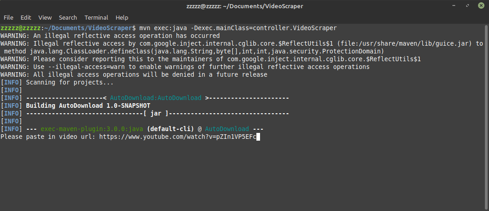
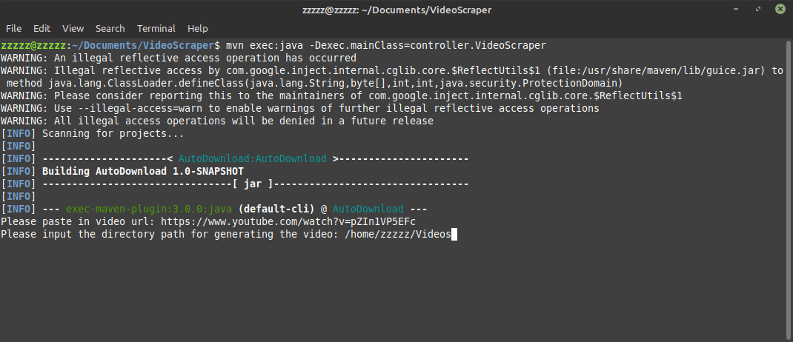
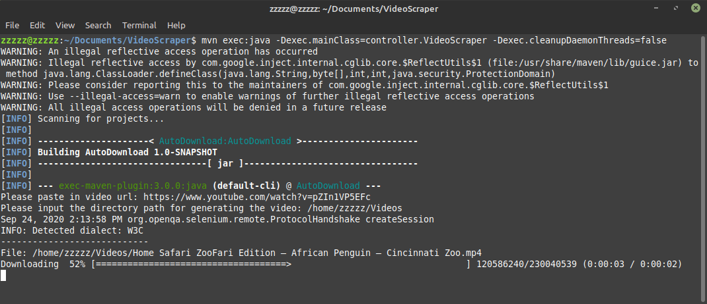

# VideoScraper

## About

VideoScraper is a tool to download videos from YouTube, Twitter, and bilibili. It 
will not directly download video segments created by the above websites. Instead, 
it will scrape video links from third-party websites. These third party websites 
will process those video segments for us, and generate video links that point at a 
complete video file.

This project is a practice on Java and web scraping. The project's dependencies
are managed by Maven. It uses Selenium to imitate useractions and load Html code 
generated by JavaScripts. The downloading process is implemented via Java SDK.

## Requirements
- [Firefox driver](https://github.com/mozilla/geckodriver/releases) (Gives command to firefox browser)
- [Firefox browser](https://www.mozilla.org/en-US/firefox/) (Load webpages)
- [Maven](https://maven.apache.org/download.cgi) (package manager)

## Installation

1. Download source code and go to project's directory
    ```
    git clone git@github.com:TPHRAB/VideoScraper.git
    cd VideoScraper
    ```
2. Download [firefox driver](https://github.com/mozilla/geckodriver/releases) and [firefox](https://www.mozilla.org/en-US/firefox/)

3. Compile and download dependencies from Maven repository
    ```
    mvn compile
    ```
4. Package all the classes into a .jar file under VideoScraper/target/
    ```
    mvn package
    ```

## Usage

1. Start the tool
    ```
    mvn exec:java -Dexec.mainClass=controller.VideoScraper -Dexec.cleanupDaemonThreads=false
    ```
    

2. Copy the video's link from Youtube, Twitter, or bilibili, paste it into the prompt
    

3. Input the directory path for your video to be generated
    

4. The download process will be started.
    
    
5. The tool will automatically quit after done downloading